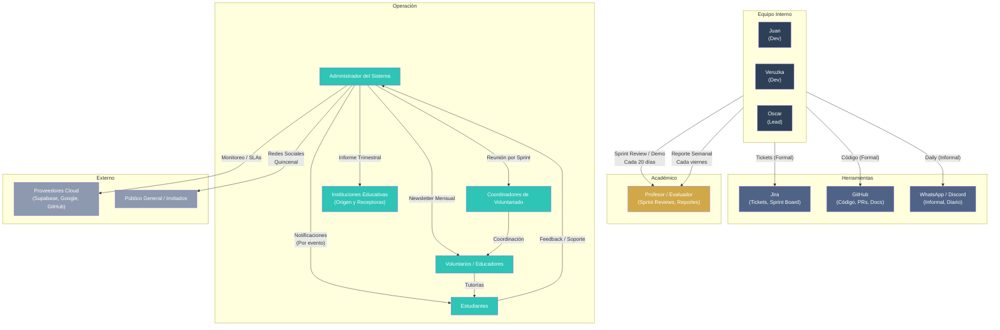

# Plan de Comunicación — Aula Señora

> **Proyecto:** Plataforma de aprendizaje que conecta voluntarios con estudiantes
> **Equipo:** Oscar Cadavid (Lead), Juan Lozano, Veruzka Guapacha
> **Metodología:** Scrum / Agile (Sprints de ~20 días)
> **Jira:** `ocadavidramirez9.atlassian.net` — Proyecto DEV (Aula Señora)
> **Sprints:** Sprint 1 — Autenticacion (Mar 19 → Abr 9), DEV Sprint 2 (Abr 8 → Abr 29), Sprint 3 — Final (May 1 → May 21)
> **Workflow:** Tareas por hacer → En curso → Finalizada
> **Fecha:** Mayo 2026

---

## 1. Tipos de Comunicación

| Tipo | Interna (Dentro del equipo) | Externa (Fuera del equipo) |
|------|----------------------------|---------------------------|
| **Formal** | • Sprint Planning<br>• Sprint Review / Demo<br>• Sprint Retrospective<br>• Jira (tickets, epics)<br>• Commits con referencias a Jira | • Entregas al Profesor/Evaluador<br>• Documentación técnica (GitHub)<br>• Informes trimestrales a instituciones<br>• Reportes de progreso a coordinadores |
| **Informal** | • WhatsApp / Discord<br>• Comentarios en código (PRs)<br>• Conversaciones cara a cara / videollamada | • Atención a estudiantes (chat de aula)<br>• Consultas rápidas con voluntarios<br>• Redes sociales / comunidad |

---

## 2. Cronograma de Comunicaciones

| # | Evento | Frecuencia | Responsable | Medio / Canal | Audiencia | Tipo |
|---|--------|-----------|-------------|---------------|-----------|------|
| 1 | **Daily Standup** | Diaria | Todo el equipo | WhatsApp / Discord o presencial | Equipo interno | Informal Interna |
| 2 | **Actualización de Jira** | Diaria | Cada miembro | Jira (tablero Scrum) | Equipo interno | Formal Interna |
| 3 | **Commits con referencia Jira** | Por tarea completada | Cada miembro | GitHub + Jira | Equipo interno | Formal Interna |
| 4 | **Sprint Planning** | Cada ~20 días (inicio de sprint) | Todo el equipo | Meet / presencial + Jira | Equipo interno | Formal Interna |
| 5 | **Sprint Review / Demo** | Cada ~20 días (fin de sprint) | Todo el equipo | Meet / presencial + Jira | Equipo interno + Profesor/Evaluador | Formal Externa |
| 6 | **Sprint Retrospective** | Cada ~20 días (fin de sprint) | Todo el equipo | Meet / presencial | Equipo interno | Formal Interna |
| 7 | **Reporte Semanal de Estado** | Semanal (cada viernes) | Scrum Master / Líder | Correo electrónico + PDF adjunto | Profesor/Evaluador | Formal Externa |
| 8 | **Notificación a Estudiantes** | Por evento (nueva clase, cambio horario) | Administrador / Sistema | Notificación push + correo electrónico | Estudiantes | Formal Externa |
| 9 | **Notificación a Voluntarios** | Por evento (nueva herramienta, cambio en plataforma) | Administrador / Sistema | Correo electrónico + Dashboard | Voluntarios | Formal Externa |
| 10 | **Newsletter Mensual** | Mensual | Administrador | Correo electrónico | Estudiantes + Voluntarios | Formal Externa |
| 11 | **Informe Trimestral a Instituciones** | Trimestral | Administrador / Coordinador | Correo electrónico + PDF | Instituciones de Origen y Receptoras | Formal Externa |
| 12 | **Reunión con Coordinadores** | Por sprint | Administrador + Coordinadores | Meet / presencial | Coordinadores de Voluntariado | Formal Externa |
| 13 | **Benchmarking Competencias** | Trimestral | Equipo interno | Documento interno (Google Docs / Notion) | Equipo interno | Informal Interna |
| 14 | **Atención a Usuarios (Soporte)** | Bajo demanda | Administrador | Chat en plataforma + correo | Estudiantes + Voluntarios | Informal Externa |
| 15 | **Publicaciones en Redes Sociales** | Quincenal | Administrador / Equipo | Instagram / Twitter / LinkedIn | Público General | Informal Externa |

---

## 3. Plantillas de Comunicación

### 3.1 Plantilla — Acta de Sprint Review / Demo

```markdown
# Acta de Sprint Review — Sprint 3 — Final

**Fecha:** 21/05/2026
**Duración:** 01:30
**Participantes:** Oscar Cadavid, Juan Lozano, Veruzka Guapacha, Profesor/Evaluador
**Enlace:** Google Meet

---

## Objetivos del Sprint
- [x] Integrar servicios Cloud (Cloudinary, Google Calendar, Google Meet)
- [x] Implementar panel de administración con gráficas y métricas (Chart.js)
- [x] Pulido final UI/UX, QA y documentación del proyecto

## Historias Completadas
| ID | Historia | Responsable | SP | Estado |
|----|----------|-------------|----|--------|
| DEV-40 | Infraestructura y Servicios Base | Juan Lozano | 5 | ✅ Finalizada |
| DEV-44 | Gestión de Materiales (Cloud Storage) | Veruzka Guapacha | 8 | ✅ Finalizada |
| DEV-49 | Integración de Google Meet y Google Calendar | Oscar Cadavid | 5 | ✅ Finalizada |
| DEV-53 | Dashboard Admin Funcional | Veruzka Guapacha | 5 | ✅ Finalizada |
| DEV-57 | Visualización de Datos (Gráficas Admin) | Oscar Cadavid | 8 | ✅ Finalizada |
| DEV-61 | Pulido y QA Final | Juan Lozano | 3 | ✅ Finalizada |

**Total:** 6 historias completadas — 34/34 SP (100% del sprint)

## Historias No Completadas
Ninguna — todas las historias del Sprint 3 fueron finalizadas.

## Demo en Vivo
- [x] Se realizó demo de funcionalidades
- [x] El evaluador probó la plataforma
- [x] Se recibió retroalimentación

## Retroalimentación del Evaluador
1. Interfaz móvil responsiva funciona correctamente en 320px (RNF-01 cumplido)
2. La integración con Google Meet para aulas virtuales es un diferenciador importante
3. Se sugiere mejorar los tiempos de carga en la subida de archivos a Cloudinary

## Acciones Pendientes
- [ ] Optimizar compresión de imágenes antes de subir a Cloudinary — Responsable: Oscar — Fecha: 28/05
- [ ] Agregar tooltips en gráficas del dashboard admin — Responsable: Veruzka — Fecha: 28/05

---

**Próximo Sprint Review:** Pendiente — Sprint 3 — Final 2 (fecha por definir)
```

### 3.2 Plantilla — Reporte Semanal de Estado

```markdown
# Reporte Semanal de Estado — Semana 2

**Proyecto:** Aula Señora
**Período:** 12/05 — 18/05/2026
**Elaborado por:** Oscar Cadavid

---

## Resumen Ejecutivo
Avance significativo en las integraciones Cloud y el panel administrativo. Se completó la integración de Google Meet con Calendar, el dashboard admin con tabla de gestión de voluntarios y las gráficas de Chart.js. Queda pendiente el pulido final y QA para la última semana del sprint.

## Métricas del Sprint
- **Story Points Completados:** 26 / 34 (76% del sprint)
- **Tareas Abiertas:** 2 (DEV-58, DEV-62)
- **Tareas Cerradas:** 11 (DEV-54, DEV-55, DEV-56, DEV-50, DEV-51, DEV-52, DEV-45, DEV-46, DEV-47, DEV-48, DEV-53)
- **Velocidad del Equipo:** 13 SP/semana

## Logros de la Semana
1. Integración completa de Google Meet + Calendar — los voluntarios pueden generar enlaces de videollamada al crear un aula y los estudiantes ven el botón "Unirse al Aula" con redirección dinámica (DEV-49, DEV-50, DEV-51, DEV-52)
2. Dashboard admin funcional con tabla de aprobación/rechazo de voluntarios y alertas de moderación automáticas (DEV-53, DEV-54, DEV-55, DEV-56)
3. Subida y descarga de materiales educativos vía Cloudinary desde el perfil del aula (DEV-44, DEV-45, DEV-46, DEV-47, DEV-48)

## Bloqueadores / Riesgos
| # | Descripción | Impacto | Plan de Mitigación |
|---|-------------|---------|-------------------|
| 1 | DEV-14: Complejidad excesiva en interfaz para estudiantes/voluntarios | Medio | Evaluar con Veruzka si los nuevos dashboards resuelven la usabilidad; considerar tour guiado on-boarding |
| 2 | DEV-21: Problemas de privacidad y protección de datos de menores | Alto | Validar que el borrado lógico (DEV-32) esté operativo; revisar política de privacidad |

## Próximos Pasos (Semana Siguiente)
- [ ] Finalizar gráficas de Chart.js (inyección en layout, pastel y barras) — DEV-58, DEV-59, DEV-60
- [ ] Ajuste de micro-animaciones y feedback visual — DEV-62
- [ ] Documentación final del proyecto y limpieza de logs — DEV-63

## Capturas / Evidencias
- Dashboard admin con tabla de gestión: `[captura]`
- Botón "Unirse al Aula" con Meet: `[captura]`
- Formulario de subida de materiales en perfil de aula: `[captura]`
```

### 3.3 Plantilla — Notificación a Usuarios (Estudiantes / Voluntarios)

```markdown
**Asunto:** ¡Novedad! Ahora puedes unirte a tus tutorías por Google Meet — Aula Señora

---

Hola [Nombre],

¡Tenemos una nueva funcionalidad para mejorar tu experiencia en la plataforma! Ahora todas las tutorías pueden realizarse de forma virtual a través de Google Meet.

**Detalles:**
- **¿Qué?** Cada aula creada por un voluntario genera automáticamente un enlace de Google Meet y se sincroniza con Google Calendar
- **¿Cuándo?** Desde el 21 de mayo de 2026
- **¿Dónde?** En el detalle de cada aula, verás un botón "Unirse al Aula" que te redirige a la videollamada en el horario agendado
- **¿Por qué?** Para que puedas recibir tus tutorías desde cualquier lugar, sin necesidad de desplazarte

Además, los voluntarios ahora pueden subir materiales educativos (PDF, imágenes) directamente al aula, y los estudiantes pueden descargarlos desde su dashboard.

¡Ingresa ahora y prueba las nuevas funcionalidades!

Saludos,
Equipo Aula Señora

---

_Si tienes dudas, responde a este correo o escríbenos al chat de la plataforma._
```

### 3.4 Plantilla — Informe Trimestral a Instituciones

```markdown
# Informe Trimestral — Aula Señora

**Período:** Q1 — Febrero a Mayo 2026
**Institución:** [Nombre de la Institución]
**Elaborado por:** Oscar Cadavid, Project Lead
**Fecha:** 22/05/2026

---

## Resumen de Impacto
- **Tutorías gestionadas en la plataforma:** 0 → plataforma operativa
- **Estudiantes registrados:** [N] (en producción)
- **Voluntarios registrados:** [N] (en producción)
- **Roles implementados:** Estudiante, Voluntario, Administrador
- **Tutorías virtuales habilitadas:** Google Meet + Calendar sincronizado
- **Sprints ejecutados:** 3 (Sprint 1 — Autenticacion, DEV Sprint 2, Sprint 3 — Final)
- **Total historias completadas:** 20

## Resultados por Institución
| Institución | Estudiantes | Voluntarios | Tutorías | Materiales Subidos |
|-------------|-------------|-------------|----------|-------------------|
| [Nombre] | [N] | [N] | [N] | [N] |

## Logros Destacados
1. **Plataforma Mobile-First operativa** — Interfaz responsiva desde 320px con dashboards diferenciados por rol (estudiante, voluntario, admin)
2. **Autenticación segura** — Login con email/contraseña + Google OAuth2 + reCAPTCHA v3 + protección contra fuerza bruta (bloqueo de 24h)
3. **Tutorías virtuales con Google Meet** — Integración completa de Google Calendar y Meet para videollamadas, más subida de materiales educativos a Cloudinary
4. **Panel administrativo con BI** — Dashboard con Chart.js: gráfica de distribución de usuarios (pastel) y estados de tutorías (barras), más tabla de gestión de voluntarios

## Áreas de Mejora
1. Optimización de compresión de imágenes previo a subida a Cloudinary para reducir tiempos de carga
2. Mejora de la usabilidad en onboarding para nuevos voluntarios (reducir complejidad percibida — DEV-14)
3. Implementar notificaciones push vía Firebase Cloud Messaging (pendiente para próxima versión)

## Próximos Pasos
- Sprint 3 — Final 2: correcciones post-lanzamiento y documentación complementaria
- Evaluación y defensa del proyecto ante el profesor/evaluador
- Plan de despliegue continuo y mantenimiento de la plataforma

---

_Aula Señora — https://github.com/zpeedy0818/Aula-Senora_
```

---

## 4. Protocolos de Escalamiento

### 4.1 Niveles de Severidad

| Nivel | Severidad | Definición | Tiempo de Respuesta | Tiempo de Resolución | Responsable Inicial | Escalamiento |
|-------|-----------|-----------|---------------------|---------------------|-------------------|--------------|
| 1 | **Leve** | Bug menor sin impacto en usuarios (error ortográfico, layout menor) | 48 horas | 72 horas | Cualquier miembro del equipo | No aplica |
| 2 | **Moderado** | Funcionalidad rota no crítica (falla en filtro de búsqueda, error en perfil) | 24 horas | 48 horas | Desarrollador asignado | Líder técnico |
| 3 | **Grave** | Funcionalidad crítica caída (registro, login, creación de aulas, pago) | 4 horas | 24 horas | Líder técnico | Administrador del sistema |
| 4 | **Crítico** | Violación de seguridad, pérdida de datos, caída total del sistema | 1 hora | 8 horas | Administrador del sistema | Profesor/Evaluador + Proveedores Cloud |

### 4.2 Ruta de Escalamiento

```
Nivel 1 (Leve)
  └─→ Cualquier miembro del equipo lo resuelve
      └─→ Se documenta en Jira como bug menor

Nivel 2 (Moderado)
  └─→ Desarrollador asignado investiga
      ├─→ ¿Lo resuelve en 48h? → Cerrar ticket
      └─→ ¿No lo resuelve? → Escalar a Líder Técnico

Nivel 3 (Grave)
  └─→ Líder Técnico notifica al equipo por WhatsApp/Discord
      ├─→ ¿Se resuelve en 24h? → Publicar parche + informe post-mortem
      └─→ ¿No se resuelve? → Escalar a Administrador del Sistema

Nivel 4 (Crítico)
  └─→ Administrador del Sistema activa protocolo de emergencia
      ├─→ Notificar a Profesor/Evaluador
      ├─→ Contactar a Proveedores Cloud (Supabase, Google)
      └─→ Comunicar a usuarios afectados (estudiantes, voluntarios)
```

### 4.3 Reglas de Escalamiento

1. **Todo reporte** debe registrarse en Jira con su nivel de severidad
2. **Silencio del responsable** por más del 50% del tiempo de respuesta = escalamiento automático al nivel superior
3. **Incidentes críticos (Nivel 4)** requieren un informe post-mortem dentro de los 5 días hábiles siguientes
4. **Comunicación a usuarios** solo después de que el incidente esté contenido (no durante)
5. **El Profesor/Evaluador** debe ser informado de cualquier incidente de Nivel 3 o 4

---

## 5. Diagrama de Flujo de Comunicación



### Leyenda del Diagrama

| Elemento | Significado |
|----------|------------|
| Rectángulo azul oscuro | Equipo interno del proyecto |
| Rectángulo gris azulado | Herramientas de comunicación |
| Rectángulo dorado | Stakeholder académico (evaluador) |
| Rectángulo verde agua | Stakeholders operativos del día a día |
| Rectángulo gris claro | Stakeholders externos sin interacción directa |
| Flecha sólida | Flujo formal de comunicación |
| Flecha con etiqueta | Frecuencia o detalle del flujo |

---

## 6. Matriz de Responsabilidades de Comunicación (RACI)

| Actividad | Oscar (Lead) | Juan | Veruzka | Profesor | Coordinadores |
|-----------|-------------|------|---------|----------|---------------|
| Daily Standup | Participa | Participa | Participa | — | — |
| Sprint Planning | Facilita | Participa | Participa | — | — |
| Sprint Review / Demo | Presenta | Presenta | Presenta | Evalúa | — |
| Reporte Semanal | Elabora / Envía | Revisa | Revisa | Recibe | — |
| Notificación a Estudiantes | Aprueba | — | Ejecuta | — | — |
| Notificación a Voluntarios | Aprueba | Ejecuta | — | — | Aprueba |
| Informe Trimestral | Revisa | Elabora | Revisa | — | Recibe |
| Gestión de Incidentes Nv 3-4 | Lidera | Escala | Escala | Informado | Informado |
| Actualización de Jira | Diario | Diario | Diario | — | — |
| Redes Sociales | Aprueba | — | Ejecuta | — | — |

**RACI:** R = Responsable, A = Aprueba, C = Consultado, I = Informado

---

## 7. Datos de Referencia del Proyecto (Extraídos de Jira)

| Métrica | Valor |
|---------|-------|
| **Proyecto** | DEV — Aula Señora |
| **Total de issues** | 57 (20 Historias, 18 Subtareas, 10 Riesgos, 8 Epics, 1 Tarea) |
| **Issues finalizadas** | 53 |
| **Issues en curso** | 4 (DEV-14, DEV-16, DEV-18, DEV-19) |
| **Workflow** | Tareas por hacer → En curso → Finalizada |
| **Epics** | Autenticación (DEV-10), Gestión Usuarios (DEV-11), Gestión Admin (DEV-23), UX/UI (DEV-34), Cronograma (DEV-35), Cloud (DEV-37), BI (DEV-38), QA (DEV-39) |
| **Project Lead** | Oscar Cadavid Ramirez |
| **Versión** | Release 1.0.0 |

### Historial de Sprints

| Sprint | Período | Estado | Story Points |
|--------|---------|--------|-------------|
| Sprint 1 — Autenticacion | 19 Mar → 9 Abr 2026 | ✅ Cerrado | 16 |
| DEV Sprint 2 | 8 Abr → 29 Abr 2026 | ✅ Cerrado | 33 |
| Sprint 3 — Final | 1 May → 21 May 2026 | ✅ Cerrado | 34 |
| Sprint 3 — Final 2 | Sin fecha | 📅 Futuro | — |
